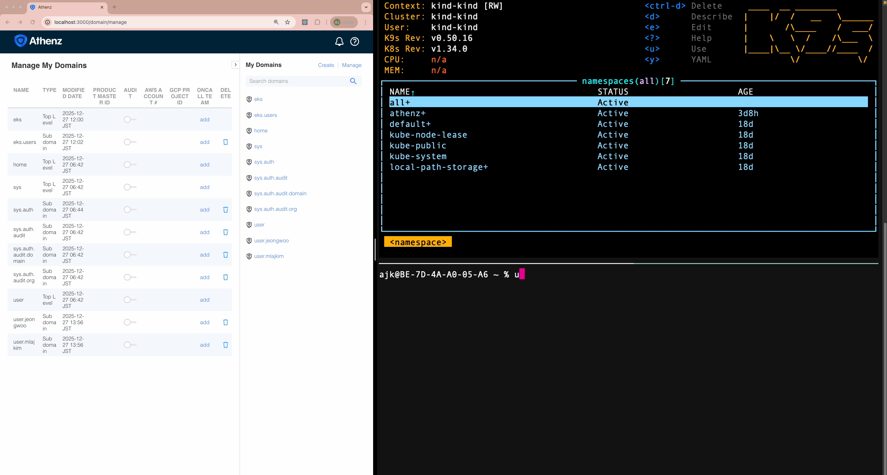
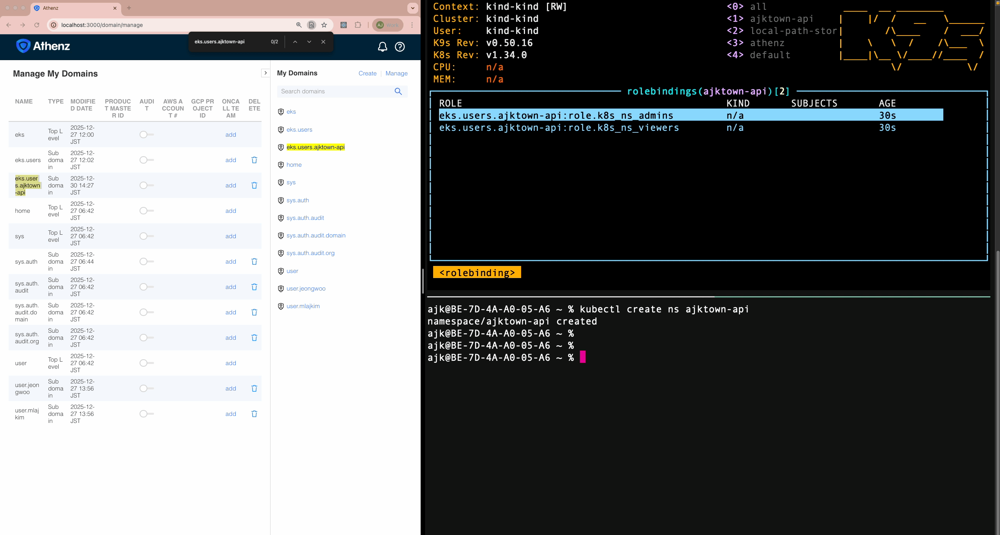
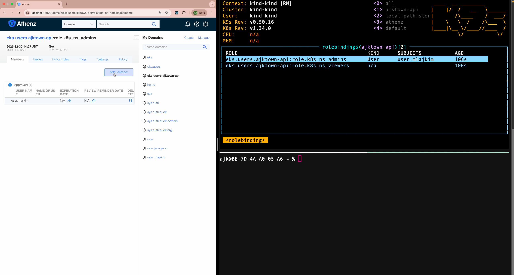

# aegis

> [!NOTE]
> This project is the **Next-Generation** iteration of [k8s-athenz-syncer-performance](https://github.com/mlajkim/k8s-athenz-syncer-performance).
> While the previous project served as a **Proof of Concept (PoC)** to understand the internal mechanics of Kubernetes Operators from scratch ("The Hard Way"), this repository focuses on **optimization, scalability, and adherence to standard Go project layouts.**

`aegis` [^1] is a Kubernetes controller that creates/manages Athenz roles & Kubernetes RBAC based on created [`AthenzDomain` CRD](https://github.com/AthenZ/k8s-athenz-syncer/blob/master/k8s/athenzdomain.yaml) created/managed by [Athenz/k8s-athenz-syncer](https://github.com/AthenZ/k8s-athenz-syncer),

<!-- TOC -->

- [aegis](#aegis)
  - [Features](#features)
  - [How to run locally](#how-to-run-locally)
    - [For those who want to run easy way](#for-those-who-want-to-run-easy-way)
    - [Run locally](#run-locally)

<!-- /TOC -->

## Features

Operator `aegis` creates the following when you simply create a namespace in your Kubernetes cluster:
- Athenz domain under certain parent domain (e.g., `eks.users`)
- Athenz roles under the created domain, that you can define in the config file
- Kubernetes RBAC Roles that correspond to the created Athenz roles, that you define in the config file



Operator `aegis` periodically polls Athenz roles under certain parent domain (e.g., `eks.users`), and syncs the members of the Athenz roles into corresponding Kubernetes RBAC Roles.



Operator `aegis` makes sure that if you delete members from Athenz roles, the members are also removed from corresponding Kubernetes RBAC Roles.



Operator `aegis` also syncs the members from registered Athenz groups into corresponding Kubernetes RBAC Roles.

🟡 TODO: Demo

## How to run locally

This operator requires the following:

- Running kubernetes cluster
- Running Athenz Server


### For those who want to run easy way

> [!TIP]
> If you know what you are doing, you can always skip this section go build your own way here: [Run locally](#run-locally)


The following command sets up:

- A simple test directory for clean start
- A local Kubernetes cluster using [kind](https://kind.sigs.k8s.io/)
- Athenz server deployed into the local Kubernetes cluster using [Athenz Distribution](https://github.com/ctyano/athenz-distribution)
- Clones this project into the test directory & copy necessary certs and keys for Athenz admin user

```sh
brew install kind && kind create cluster

_tmp_dir=$(date +%y%m%d_%H%M%S_k8s_athenz_syncer_performance)
mkdir -p ~/test_dive/$_tmp_dir && cd ~/test_dive/$_tmp_dir

git clone https://github.com/ctyano/athenz-distribution.git athenz_distribution
make -C ./athenz_distribution clean-kubernetes-athenz deploy-kubernetes-athenz
```

Once the manifests above is done, set up ZMS server:

```sh
kubectl -n athenz port-forward deployment/athenz-ui 4443:4443 &
kubectl -n athenz port-forward deployment/athenz-ui 3000:3000 &
```

Clone this project, with copying necessary certs and keys for Athenz admin user:

```sh
git clone https://github.com/mlajkim/aegis.git k8s_athenz_syncer_performance

cp ./athenz_distribution/certs/athenz_admin.cert.pem ./k8s_athenz_syncer_performance/certs/athenz_admin.cert.pem
cp ./athenz_distribution/keys/athenz_admin.private.pem ./k8s_athenz_syncer_performance/keys/athenz_admin.private.pem
```

Run the following command, and simply hit `Enter` keys with default values:

```sh
make -C ./k8s_athenz_syncer_performance run
```

### Run locally

> [!TIP]
> If you want to see running without thinking too much, check out: [For those who want to run easy way](#for-those-who-want-to-run-easy-way)

To run this operator locally, do the following:

```sh
git clone https://github.com/mlajkim/aegis.git k8s_athenz_syncer && cd k8s_athenz_syncer
make run
```

<!-- Footnote -->

[^1]: This project's name is inspired by [Kelsey Hightower's Kubernetes The Hard Way](https://github.com/kelseyhightower/kubernetes-the-hard-way)

<!-- Footnote -->
